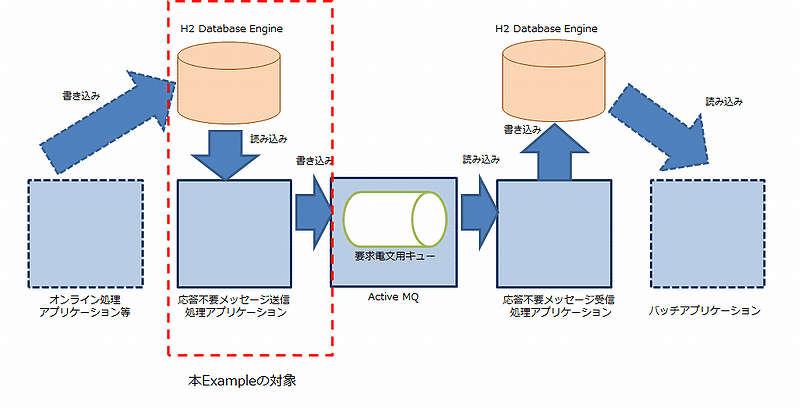

nablarch-example-mom-delayed-send
====================================

Nablarch FrameworkのMOM応答不要メッセージングの送信側のExampleで、テーブルをキューとして使ったメッセージングを用いて構築しています。
MOM応答不要メッセージングの受信側のExampleと組み合わせて使用します。

以下にメッセージングのシステムのうち、本Exampleが対象とする箇所を示します。



※図中の「オンライン処理アプリケーション等」と「バッチアプリケーション」の部分はExampleの提供はありません。

## 実行手順

### 1.動作環境
実行環境に以下のソフトウェアがインストールされている事を前提とします。
* Java Version : 17
* Maven 3.9.9以降

補足：
MOMは、MOM応答不要メッセージングの受信側のExampleに組み込まれたものを使用します。
RDBMSは、本Exampleに組み込まれたものを使用します。

### 2. プロジェクトリポジトリの取得
Gitを使用している場合、アプリケーションを配置したいディレクトリにて「git clone」コマンドを実行してください。
以下、コマンドの例です。

    $mkdir c:\example
    $cd c:\example
    $git clone https://github.com/nablarch/nablarch-example-mom-delayed-send.git

Gitを使用しない場合、最新のタグからzipをダウンロードし、任意のディレクトリへ展開してください。

### 3. アプリケーションのビルド

    $cd nablarch-example-mom-delayed-send
    $mvn package

実行に成功すると、以下のようなログがコンソールに出力されます。

    (中略)
    [INFO] ------------------------------------------------------------------------
    [INFO] BUILD SUCCESS
    [INFO] ------------------------------------------------------------------------
    (中略)

#### データベースのセットアップ及びエンティティクラスの作成について

アプリケーションを実行するためにはデータベースのセットアップ及びエンティティクラスの作成が必要ですが、これは`mvn package`の実行に含まれています。
この処理は`mvn generate-resources`で個別に実行することもできます。

※gspプラグインをJava 17で実行するためにはJVMオプションの指定が必要ですが、そのオプションは`.mvn/jvm.config`で指定しています。


### 4. アプリケーションの起動

先にMOM応答不要メッセージングの受信側のExampleを起動しておいてください。

以下のコマンドで、データベースの状態を最新化、MOM応答不要メッセージングの送信側のExampleが起動します。

    $mvn generate-resources
    $mvn exec:java -Dexec.mainClass=nablarch.fw.launcher.Main -Dexec.args="'-diConfig' 'messaging-async-send-boot.xml' '-requestPath' 'SENDAPP' '-userId' 'batch_user' '-messageRequestId' 'ProjectInsertMessage'"

なお、 `maven-assembly-plugin` を使用して実行可能jarの生成を行っているため、以下の手順にて実行することもできます。

1. ``target/application-<version_no>.zip`` を任意のディレクトリに解凍する。
2. 以下のコマンドにて実行する

    $java -jar <1で解凍したディレクトリ名>/nablarch-example-mom-delayed-send-<version_no>.jar -diConfig classpath:messaging-async-send-boot.xml -requestPath SENDAPP -userId batch_user -messageRequestId ProjectInsertMessage

起動に成功すると以下のようなログがコンソールに出力され、メッセージが送信されます。

```log
2023-02-15 14:46:38.725 -INFO- nablarch.fw.launcher.Main [null] boot_proc = [] proc_sys = [mom-delayed-send] req_id = [null] usr_id =
 [null] @@@@ APPLICATION SETTINGS @@@@
        system settings = {
        }
        business date = [20140123]
2023-02-15 14:46:39.367 -INFO- nablarch.fw.reader.DatabaseTableQueueReader [202302151446387260001] boot_proc = [] proc_sys = [mom-del
ayed-send] req_id = [SENDAPP] usr_id = [batch_user] read database record. key info: {SEND_MESSAGE_SEQUENCE=0000000001}
2023-02-15 14:46:39.456 -INFO- MESSAGING [202302151446393690002] boot_proc = [] proc_sys = [mom-delayed-send] req_id = [SENDAPP] usr_
id = [batch_user] @@@@ SENT MESSAGE @@@@
        thread_name    = [pool-1-thread-1]
        message_id     = [ID:1e07ab35-acf4-11ed-8482-9c7befbbf589]
        destination    = [TEST.REQUEST]
        correlation_id = [null]
        reply_to       = [null]
        time_to_live   = [0]
        message_body   = [ProjectInsertMessage0000000001                    プロジェクト００１

                                                                  development
                                                             s
                                                        20100918201504091        鈴木

                                                                       佐藤

                                                             100      備考欄


                              10000    1000     2000     3000       ]
```


自動的に終了はしないため、ctrl + c等で終了させてください。

### 5. DBの確認方法

1. https://www.h2database.com/html/download.html からH2をインストールしてください。  

2. {インストールフォルダ}/bin/h2.bat を実行してください(コマンドプロンプトが開く)。  
  ※h2.bat実行中はExampleアプリケーションからDBへアクセスすることができないため、Exampleアプリケーションを停止しておいてください。

3. ブラウザから http://localhost:8082 を開き、以下の情報でH2コンソールにログインしてください。
   JDBC URLの{dbファイルのパス}には、`SAMPLE.h2.db`ファイルの格納ディレクトリまでのパスを指定してください。  
  JDBC URL：jdbc:h2:{dbファイルのパス}/SAMPLE  
  ユーザ名：SAMPLE  
  パスワード：SAMPLE
